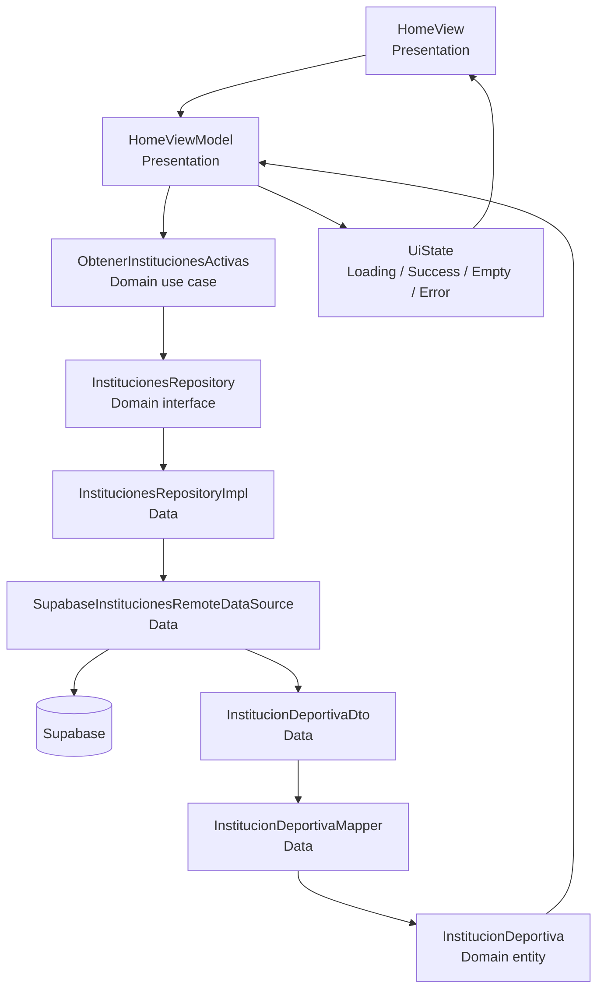

# Arquitectura de GameOn Network · Taller 02

## Funcionalidad vertical seleccionada

**Visualizar instalaciones deportivas**.

## Diagrama

## Regla de dependencia

La capa de dominio no importa clases de `data` ni `presentation`. La presentación conoce únicamente contratos y entidades del dominio. La implementación concreta del repositorio queda en `data` y se conecta mediante inyección de dependencias.

## Flujo de la funcionalidad

1. `HomeView` solicita la carga al `HomeViewModel`.
2. El ViewModel emite `Loading`.
3. El ViewModel ejecuta el caso de uso `ObtenerInstitucionesActivas`.
4. El caso de uso invoca el contrato `InstitucionesRepository`.
5. `InstitucionesRepositoryImpl` solicita datos al datasource de Supabase.
6. La respuesta se representa inicialmente como `InstitucionDeportivaDto`.
7. El mapper transforma cada DTO en `InstitucionDeportiva` de dominio.
8. Si existen elementos, el ViewModel emite `Success`.
9. Si la lista está vacía, emite `Empty`.
10. Si ocurre una excepción, emite `ErrorState` con una acción `retry`.
